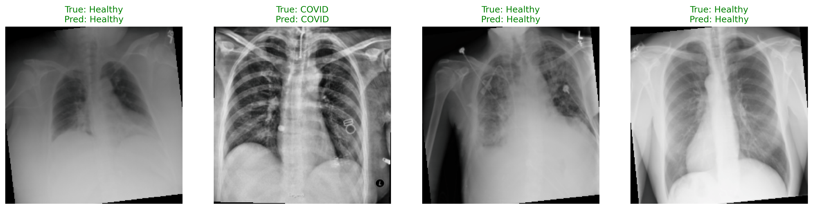
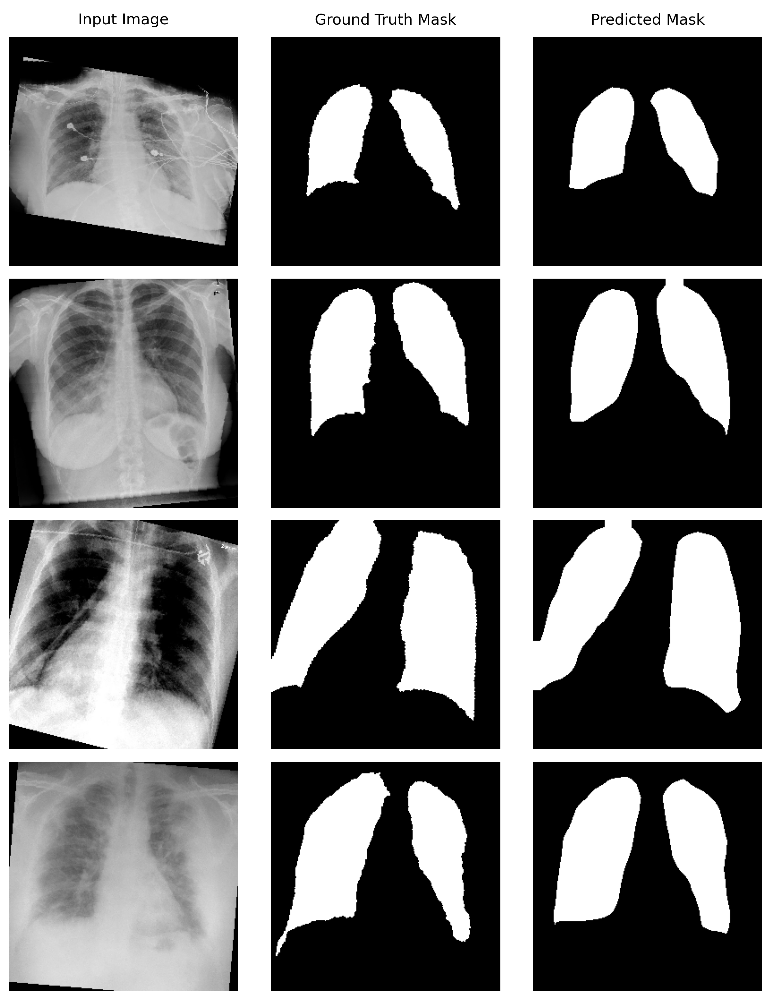

# DinoX-Ray: Chest X-Ray Perception with DINOv3

A modular, PyTorch-based computer vision pipeline leveraging Meta's **DINOv3** vision foundation model for diagnostic analysis of Chest X-Rays. This repository demonstrates both **image classification** (COVID vs. Healthy) and **semantic segmentation** (Lung Masking).

By utilizing a frozen foundation backbone with lightweight decoders, this pipeline achieves rapid convergence, prevents catastrophic forgetting of pre-trained spatial features, and operates efficiently without requiring massive compute overhead.

## Installation

Clone the repository:

```bash
git clone https://github.com/violayhho/DinoX-Ray.git
cd DinoX-Ray
```

Environment setup:

```bash
conda env create -f conda.yaml
conda activate dinov3
```

Clone DINOv3:
```bash
git clone https://github.com/facebookresearch/dinov3.git
```

## Repository Structure

```text
├── dataset_generator.py     # Generate `COVID.txt` and `healthy.txt`
├── dataset.py               # Custom PyTorch Datasets (ChestXRayClfDataset, ChestXRaySegDataset)
├── models.py                # DINOv3 Backbone, Classifier, and Segmenter definitions
├── criterions.py            # Focal, Dice, FocalDice losses and evaluation metrics
├── train.py                 # Main training loop with dynamic pipeline routing
├── visualize.py             # Inference and visualie validation results
└── saved_models/            # Directory for best .pth weights
```

## Data Acquisition

This project utilizes two distinct public datasets. You will need to download both to fully replicate the training pipeline.

**1. ChestX-ray14 Dataset (Healthy Images)**
Provided by the NIH Clinical Center, this dataset contains the healthy radiographs used for the classification baseline.
* **Source:** [NIH ChestX-ray14 Box Repository](https://nihcc.app.box.com/v/ChestXray-NIHCC/folder/37178474737)
* **Instructions:** Download the `images_*.tar.gz` archives and extract them into a folder named `ChestX-ray14/` within your `data_root`.

**2. COVID-19 Chest X-ray Dataset (COVID Images & Masks)**
An open database of COVID-19 cases containing the positive class images and their corresponding lung segmentation masks.
* **Source:** [ieee8023/covid-chestxray-dataset](https://github.com/ieee8023/covid-chestxray-dataset)
* **Instructions:** You can clone this repository directly into your `data_root`:
  ```bash
  cd /path/to/your/data_root
  git clone [https://github.com/ieee8023/covid-chestxray-dataset.git](https://github.com/ieee8023/covid-chestxray-dataset.git)
  ```

## Data Preparation
The PyTorch dataloaders rely on index files to quickly locate and label images. The `dataset_generator.py` script parses the raw metadata, filters for strictly healthy and COVID-positive patients, and generates the required `COVID.txt` and `healthy.txt` files inside your data directory. It also aggregates the filtered images into standalone folders for easy inspection.

Run the script from the repository folder, passing the path to your downloaded data:
```bash
python dataset_generator.py --data_root /path/to/your/data_root
```
## Dataset Structure

The dataloaders expect a specific directory layout. The `--data_root` argument should point to a parent directory containing the two dataset folders (`ChestX-ray14` and `covid-chestxray-dataset`), as well as the text files (`COVID.txt`, `healthy.txt`) that list the relative paths to the images.

```text
data_root/
├── COVID.txt                          # Contains relative paths to COVID images
├── healthy.txt                        # Contains relative paths to healthy images
├── ChestX-ray14/                      # Directory containing healthy images
│   ├── images_001/                            
│   │   ├── 00000181_027.png
│   │   ├── 00000447_002.png
│   │   └── ...
│   └── ...
└── covid-chestxray-dataset/           # Directory containing COVID images & masks
    ├── images/                    
    │   ├── 16745_7_1.png
    │   └── ...
    └── annotations/
        └── lungVAE-masks/             # Corresponding segmentation masks
            ├── 16745_7_1_mask.png     # Mask filename dynamically maps to image name + '_mask'
            └── ...
```

* **Classification Task:** Uses both `COVID.txt` (Label 1) and `healthy.txt` (Label 0) to assemble the dataset.
* **Segmentation Task:** Reads paths from `COVID.txt` and dynamically replaces the `images/` directory with `annotations/lungVAE-masks/` to fetch the corresponding ground-truth mask.

## Training

The `train.py` script uses dynamic routing to construct the correct pipeline based on the specified task. The DINOv3 backbone remains in `.eval()` mode during training to lock batch statistics and preserve foundation features, while the optimizer strictly updates the lightweight decoder heads.

**Train the Classification Model:**
```bash
python train.py --task classification --model_name dinov3_vitl16 --epochs 10 --batch_size 8
```

**Train the Segmentation Model:**
```bash
python train.py --task segmentation --model_name dinov3_vitl16 --epochs 10 --batch_size 8 --weight_focal 1.0 --weight_dice 1.0
```

### Arguments
* `--task`: `classification` or `segmentation` (Default: `segmentation`)
* `--model_name`: DINOv3 variant to load, e.g., `dinov3_vits16`, `dinov3_vitb16`, `dinov3_vitl16` (Default: `dinov3_vitl16`)
* `--data_root`: Path to the Chest X-Ray dataset directory.
* `--epochs`: Number of training epochs (Default: 10)
* `--lr`: Learning rate (Default: 1e-4)
* `--weight_decay`: Weight decay for the optimizer (Default: 1e-2)

## Evaluation & Visualization

To run inference on the validation set and visualize the results, run the `visualize.py` script. It automatically loads the best saved `.pth` weights for both tasks and reverses the ImageNet normalization for rendering.

```bash
python visualize.py --data_root /path/to/your/data
```

### Classification Results
<p align="center">
  
</p>

### Segmentation Results
<p align="center">
  
</p>